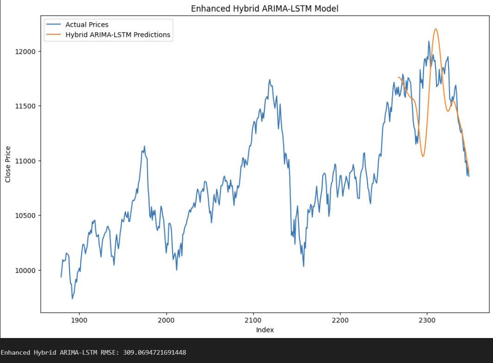

# **NIFTY50 Prediction Using ARIMA and LSTM**

# **RESULTS**

## **Overview**
This project explores time series prediction for the NIFTY50 index using two powerful modeling approaches:

1. **ARIMA (AutoRegressive Integrated Moving Average):** A traditional statistical model tailored for linear patterns in time series data. It performs well with time series data that exhibit trends or seasonality
2. **LSTM (Long Short-Term Memory):** LSTM is a type of recurrent neural network designed to handle long-term dependencies and nonlinear patterns. It captures complex relationships that ARIMA cannot model.

This project implements a hybrid ARIMA-LSTM model to predict future stock prices using the NIFTY 50 dataset. By combining the strengths of ARIMA (Autoregressive Integrated Moving Average) and LSTM (Long Short-Term Memory) neural networks, the model captures both linear and nonlinear trends in stock price data.

---

## **Methodology**

### 1. **Data Preparation**
- The data is split into training (80%) and testing (20%)
- The Close price column is used as the target variable for predictions.

### 2. **ARIMA Model**
- Used for linear forecasting.
- A grid search is conducted over a range of (p, d, q) values to find the best ARIMA parameters based on AIC (Akaike Information Criterion).
- The selected ARIMA model is fitted to the training data.
- Residuals (the difference between actual and predicted values) are calculated to quantify the remaining nonlinear patterns.

### 3. **LSTM Model**
- Captures complex relationships and nonlinear trends.
- Steps :
  - Residuals from ARIMA are scaled to the range [0, 1] using MinMaxScaler.
  - A sliding window approach is used to create training data for the LSTM model.
  - Each sample consists of look_back (default: 60) sequential residuals.
  - The LSTM model architecture includes multiple layers:
      - Four LSTM layers with decreasing units (256, 128, 64, 32) and Dropout for regularization.
      - Fully connected Dense layers for final output.
  - Early stopping is used to prevent overfitting, and a custom RMSE callback monitors training performance.

### 4. **Hybrid Forecasting**
- ARIMA forecasts are combined with LSTM predictions of the residuals to generate the final predictions.

### 5. **Evaluation**
- RMSE is calculated to evaluate the model's performance.
- Training and validation loss as well as RSME trends are plotted for analysis

---
## Advantages of ARIMA and LSTM

### ARIMA:
- Excellent for capturing linear trends and seasonality in time series data.
- Provides interpretable parameters for understanding the time series' structure.

### LSTM:
- Handles complex nonlinear relationships in data.
- Capable of modeling long-term dependencies, which are common in financial time series.

### Hybrid Approach:
- **Strengths of ARIMA:** Models the linear structure, making it easier for LSTM to focus on nonlinear residuals.
- **Strengths of LSTM:** Enhances prediction accuracy by capturing patterns ARIMA cannot model.
- **Combined Advantage:** The hybrid model effectively captures both linear and nonlinear patterns, leading to more accurate and robust predictions.

## Results
- The hybrid ARIMA-LSTM model demonstrates superior performance compared to standalone ARIMA or LSTM models.
- Visualizations illustrate the alignment of predictions with actual prices.

## Files
- **NIFTY_50_Data.csv:** Input dataset with stock prices.
- **model.ipynb:** Python script implementing the hybrid model.
- **README.md:** This documentation.

## How to Run
1. Upload the `NIFTY_50_Data.csv` file.
2. Execute the Python script in a Google Colab environment.
3. Observe outputs such as predictions, RMSE values, and visualizations.

## Dependencies
- Python libraries: `pandas`, `numpy`, `matplotlib`, `statsmodels`, `sklearn`, `tensorflow`

## Future Work
- Explore more advanced ARIMA and LSTM configurations.
- Integrate exogenous variables (e.g., macroeconomic indicators) to enhance predictive power.
- Extend the approach to other financial datasets or domains.

## Conclusion
This hybrid ARIMA-LSTM model effectively combines the strengths of traditional statistical methods and modern machine learning approaches, providing a comprehensive solution for time series forecasting tasks.

